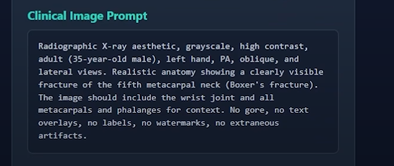
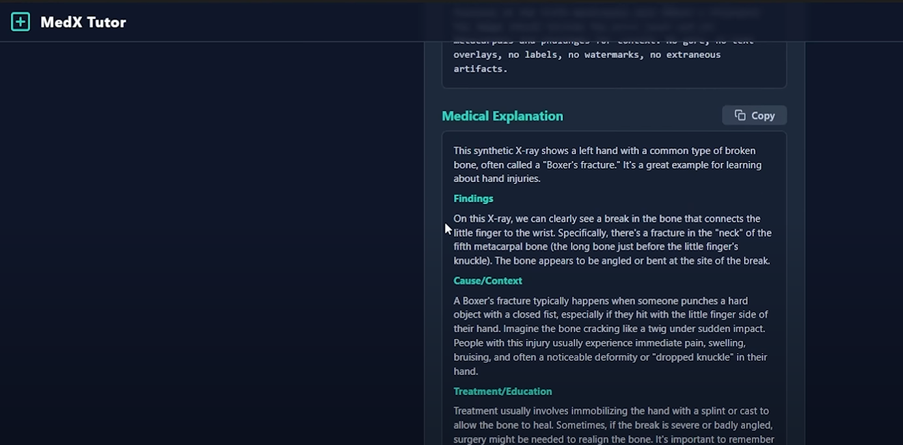
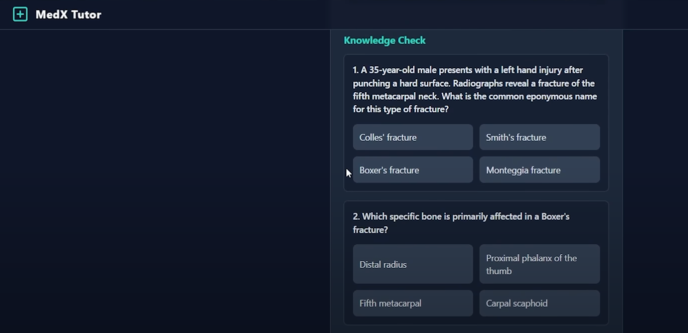
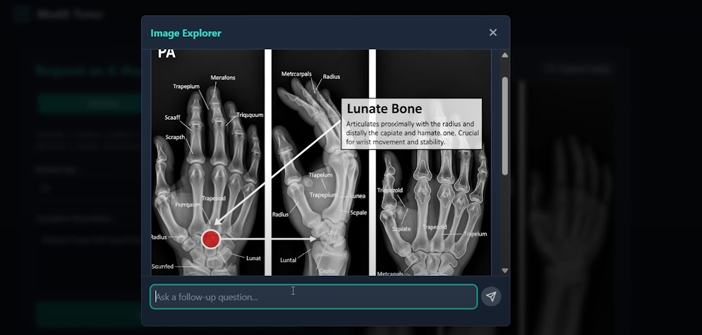

<!-- LOGO -->
<div align="center">
  
  <h1 align="center">MedX Tutor</h1>
  <p align="center">
    An AI-powered medical imaging assistant for students and educators.
    <br />
    <br />
    <!-- TODO: Add your live demo link here -->
    <a href="https://www.youtube.com/watch?v=85wIQd-4EEg"><strong>Explore the Live Demo »</strong></a>
    <br />
    <br />
  </p>
</div>

<!-- BADGES -->
<div align="center">
  
  
  
  
</div>

---


## Problem Statement:  
Medical trainees and students often lack truly interactive hands-on tools for learning X-ray interpretation. Traditional resources are static, costly, or inaccessible, limiting the quality and confidence of real-world training.

MedX Tutor solves this by using generative AI to provide instant, interactive synthetic X-rays and explanations—bringing the magic of practical radiology labs to any learner, anywhere.

## Overview
MedX Tutor is a next-generation educational platform that uses Gemini AI to generate synthetic, annotated X-rays from natural language prompts. Students can...


## ✨ Introduction

MedX Tutor is a cutting-edge educational tool designed to bridge the gap between theoretical medical knowledge and practical radiographic interpretation. Powered by Google's Gemini AI, it allows medical students, residents, and educators to:

-   **Generate** realistic, synthetic X-ray images from simple text descriptions.
-   **Upload** existing X-ray images for detailed AI analysis.
-   **Learn** through AI-generated explanations, interactive quizzes, and a contextual chat assistant.

This project aims to provide a safe and effective environment for honing diagnostic skills without the need for real patient data.

## 🚀 Key Features

-   **📝 Natural Language Prompting:** Describe a condition in plain English or Hindi (e.g., "fractured left hand"), and the AI generates a clinically accurate prompt and a corresponding X-ray.
-   **🖼️ High-Quality Image Generation:** Creates realistic, high-contrast grayscale X-ray images using the `imagen-4.0-generate-001` model.
-   **⬆️ Upload & Analyze:** Upload your own X-ray images for the AI to analyze and describe.
-   **🧠 Detailed Explanations:** Receive structured, beginner-friendly explanations covering findings, causes, and typical treatments.
-   **✅ Interactive Quizzes:** Test your knowledge with AI-generated multiple-choice questions based on the X-ray scenario.
-   **💬 Contextual AI Chat:** Ask follow-up questions about the X-ray, and the AI will provide answers based on the image context.
-   **👆 Image Explorer:** A unique point-and-ask feature. Click on any part of the image, and the AI will provide a detailed explanation and an annotated diagram of that specific area.
-   **📄 PDF & Image Export:** Download the generated X-ray and a comprehensive report for offline study.

## 🎬 Live Demo & Walkthrough

Here’s a quick look at the two primary workflows in MedX Tutor.


### 1. Generating an X-Ray from a Text Prompt

Simply describe the patient's condition, set the age and gender, and watch the AI bring it to life.


### 2. Uploading and Analyzing an Existing X-Ray

Upload an image from your computer, and the AI will provide a full analysis, explanation, and quiz.


## 🛠️ How It Works: A Deeper Look


#### 1. Input & Generation
The user provides a simple description. MedX Tutor uses `gemini-2.5-flash` to refine this into a detailed clinical prompt, which is then passed to `imagen-4.0-generate-001` to create the X-ray image.

<p align="center">
  
</p>

#### 2. Analysis & Explanation
Once an image is generated or uploaded, the AI provides a comprehensive breakdown, including the clinical prompt and a structured medical explanation.

<p align="center">
  
</p>

#### 3. Interactive Learning Tools
Reinforce your learning with automatically generated quizzes and a contextual chat assistant that knows the specifics of the current X-ray.

<p align="center">
  
</p>

#### 4. Image Explorer (Point-and-Ask)
Click anywhere on the image to open the Explorer. The AI (`gemini-2.5-flash-image-preview`) analyzes the specific point, provides a targeted explanation, and generates a new, annotated diagram for clarity.

<p align="center">
  
</p>

## 🤖 Gemini Integration

MedX Tutor leverages a sophisticated, multi-model approach using Google's Gemini API to deliver its powerful educational features. Gemini is not just a single component but the core intelligent engine that drives every aspect of the learning experience.

-   **Text & Logic (`gemini-2.5-flash`):** The versatile and fast `gemini-2.5-flash` model handles all language-based tasks. It interprets a user's plain-language request (in English or Hindi) and transforms it into a precise clinical prompt. It then generates structured, beginner-friendly medical explanations and creates contextually relevant multiple-choice quizzes to test the user's understanding. This same model powers the conversational AI, enabling students to ask follow-up questions in a natural chat interface.

-   **Image Generation (`imagen-4.0-generate-001`):** The core visual component—the synthetic X-ray itself—is created by `imagen-4.0-generate-001`. This state-of-the-art image generation model takes the detailed clinical prompt and renders a high-fidelity, realistic radiographic image, complete with the specified anatomy and pathology.

-   **Multimodal Analysis (`gemini-2.5-flash-image-preview`):** The innovative "Image Explorer" feature is powered by the multimodal capabilities of `gemini-2.5-flash-image-preview`. When a user points to a specific area on an X-ray, this model analyzes the visual input alongside the implicit query. It then generates both a targeted textual explanation of the selected region and a brand new, annotated diagram to visually clarify the finding.

This strategic use of different Gemini models allows MedX Tutor to provide a seamless, rich, and deeply interactive educational workflow.

## 💻 Tech Stack

-   **Frontend:** React, TypeScript, Tailwind CSS
-   **AI / Backend:** Google Gemini API
    -   `gemini-2.5-flash` for text generation, analysis, and chat.
    -   `imagen-4.0-generate-001` for X-ray image generation.
    -   `gemini-2.5-flash-image-preview` for the Image Explorer feature.
-   **Deployment:** Designed for modern hosting platforms like Vercel or Netlify.

## 🔧 Getting Started

To get a local copy up and running, follow these simple steps.

### Prerequisites

-   Node.js (v18 or later)
-   npm or yarn
-   A Google Gemini API Key

### Installation

1.  **Clone the repo:**
    ```sh
    git clone https://github.com/pawan941394/AI-X-Ray-Imaging-Hackathon-Project.git
    cd AI-X-Ray-Imaging-Hackathon-Project
    ```
2.  **Install NPM packages:**
    ```sh
    npm install
    ```
3.  **Set up your environment variables:**
    Your project is set up to read the API key from the environment. Ensure `process.env.API_KEY` is available in your deployment environment. For local development, you might create a script to set this variable.

4.  **Run the development server:**
    ```sh
    npm run dev
    ```
    Open the local server URL provided in your console to view it in the browser.

## ⚠️ Disclaimer

<div align="center" style="background-color: #333; padding: 10px; border-radius: 5px; color: #ffcc00;">
  <strong>For educational purposes only. Not for real medical diagnosis.</strong>
  <br>
  All generated images are synthetic and should not be used for clinical decision-making.
</div>

## 👤 Author

**Pawan Kumar**

-   LinkedIn: [@pawan941394](https://www.linkedin.com/in/pawan941394/)
-   YouTube: [@Pawankumar-py4tk](https://www.youtube.com/@Pawankumar-py4tk)

---
<p align="center">
  Made with ❤️ and a passion for medical education.
</p>
